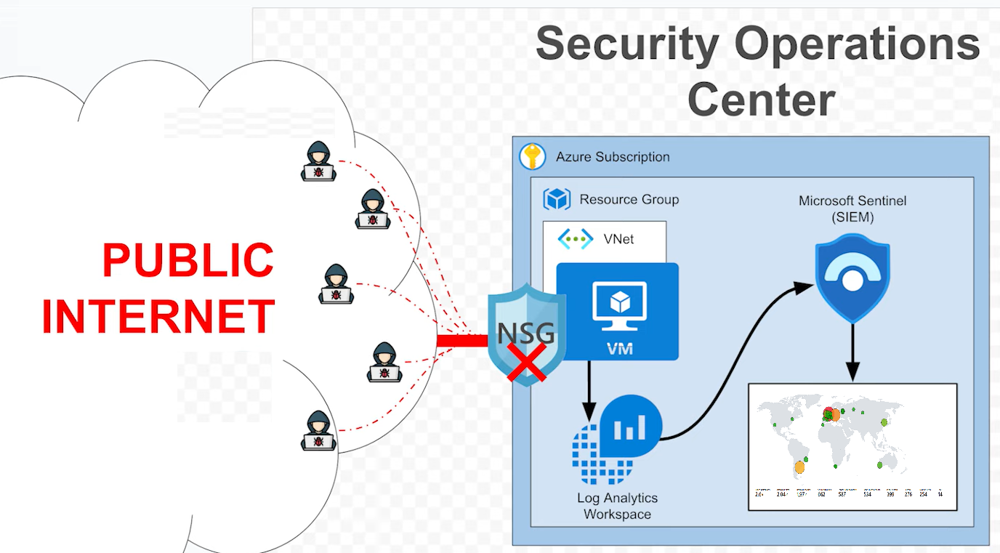

#  Cyber Lab Azure – Mise en place d’un SOC avec Microsoft Sentinel

##  Introduction
Ce projet met en place un SOC (Security Operations Center) dans Microsoft Azure, centré autour d’un **honeypot cloud**. La machine virtuelle exposée simule volontairement une cible vulnérable pour attirer et enregistrer de véritables tentatives d’attaque. Les logs de sécurité capturés sont ensuite centralisés, analysés et visualisés via **Microsoft Sentinel**, offrant un environnement opérationnel pour la détection de menaces et les opérations Blue Team.

---

##  1. Architecture du Lab  
L’élément clé de ce lab est le **honeypot** : une VM Windows 10 volontairement laissée sans durcissement pour capturer un maximum d’activités malveillantes. L’infrastructure comprend :

- **Virtual Network (VNet)** avec subnet dédié pour isoler le honeypot  
- **Machine virtuelle Windows 10 (HONEYPOT)**  
  - IP publique statique  
  - Pare-feu OS désactivé  
  - NSG ouvert sur RDP (3389) et HTTP/S (80/443)  
- **Log Analytics Workspace** pour centraliser tous les logs de la VM-honeypot  
- **Azure Monitoring Agent** installé sur la VM pour transférer les événements Windows (notamment Event ID 4625)  
- **Microsoft Sentinel** connecté au Workspace  
- **Watchlist géographique** enrichissant chaque IP malveillante avec pays, ville, latitude/longitude  

 **Capture :**  
  
*Légende : Schéma global mettant en évidence le honeypot exposé, le VNet, le NSG, le Log Analytics Workspace et Sentinel.*

---

##  2. Configuration du honeypot

###  VM Windows 10 (HONEYPOT)
- **Rôle principal :** attirer les scanners et attaques automatisées  
- **OS :** Windows 10 non durci  
- **Pare-feu local désactivé** pour maximiser la capture des tentatives  
- **Ports exposés :**  
  - RDP (3389)  
  - HTTP (80) / HTTPS (443)  
- **IP publique statique**  

 **Capture :**  
  
*Légende : NSG de la VM-honeypot entièrement ouvert vers l’Internet.*

###  Log Analytics Workspace
- Réception en temps réel des logs de la VM-honeypot  
- Collecte des **événements de sécurité Windows** (4624, 4625, etc.)  
- Point de centralisation pour Sentinel  

 **Capture :**  
  
*Légende : Azure Monitoring Agent sur la VM-honeypot, envoyant les logs vers le Workspace.*

---

##  3. Intégration de Microsoft Sentinel
- Activation sur le Workspace central  
- **Data connector Windows Security Events** capturant les tentatives du honeypot  
- Import d’une **Watchlist IP/géolocalisation**  
- Création de règles et Workbooks pour détecter et visualiser l’activité malveillante ciblant le honeypot  

 **Capture :**  
  
*Légende : Sentinel affichant la Watchlist enrichie et les données collectées depuis le honeypot.*

---

##  4. Analyse des tentatives de connexion (Event ID 4625)  
**Requête KQL pour extraire les échecs de session RDP sur le honeypot :**
 **Capture :**  

*Légende : Requête KQL affichant les attaques survenues il y a 1 minute.*

*Légende : Géolocalisation IPadress.*

---

##  5. Carte d’attaque en temps réel
Grâce à la Watchlist géographique, chaque adresse IP malveillante ciblant le honeypot est enrichie avec des métadonnées (pays, ville, latitude/longitude). Ces données sont ensuite visualisées sur une carte dynamique dans un Workbook Microsoft Sentinel, permettant de suivre en temps réel l’origine des attaques.

 **Capture :**  
  
*Légende : Visualisation géographique des attaques capturées par le honeypot.*

---

##  6. Compétences acquises
- **Déploiement et exposition d’un honeypot cloud** sur Azure  
- **Capture et centralisation** des logs de sécurité Windows (Event ID 4624, 4625)  
- **Requêtage KQL** ciblé pour extraire les tentatives malveillantes  
- **Enrichissement géographique** des données d’attaque via Watchlist  
- **Création de Workbooks** dynamiques dans Microsoft Sentinel pour la visualisation  
- Compréhension des **opérations SOC** (détection, investigation, reporting)

---

##  Conclusion
Ce lab illustre comment un simple **honeypot** exposé peut devenir un point d’observation pour la cybersécurité opérationnelle. En centralisant les événements de sécurité dans un Log Analytics Workspace et en exploitant les capacités de **Microsoft Sentinel** (KQL, Watchlist, Workbooks), il est possible de :

- Surveiller en temps réel les tentatives d’intrusion contre un système vulnérable  
- Analyser les tactiques et vecteurs d’attaque automatisés  
- Visualiser l’origine géographique des attaques pour orienter la réponse  

Ce projet constitue une excellente base pour développer mes compétences en **Blue Team** et me familiariser avec les outils SIEM cloud.

